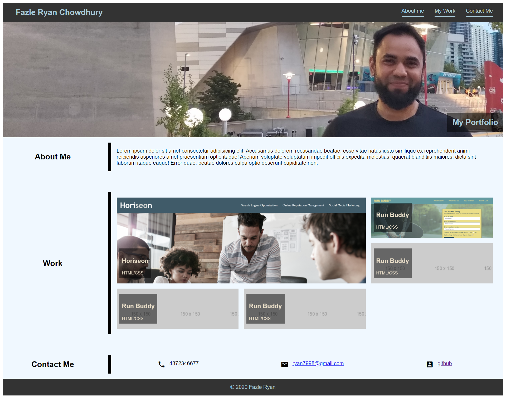

# Advanced CSS Challenge: Professional Portfolio

# Screenshot:

## Developer's name, a recent photo, and links to sections about them, their work, and how to contact them is developed

## Clicking on link, UI scrolls to the corresponding section

## First application's image is larger in size than the others

## Clicking on the images of the applications, deploys the application

## Responsive layouts created which adapts the the view port

## Flex and grid layout used in the project.

link to the site: https://ryan7998.github.io/portfolio/
